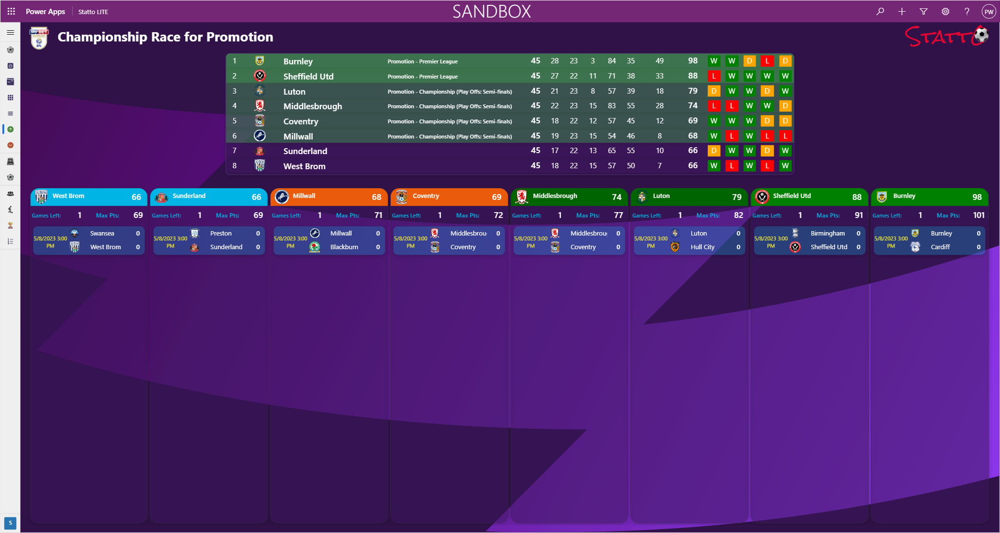
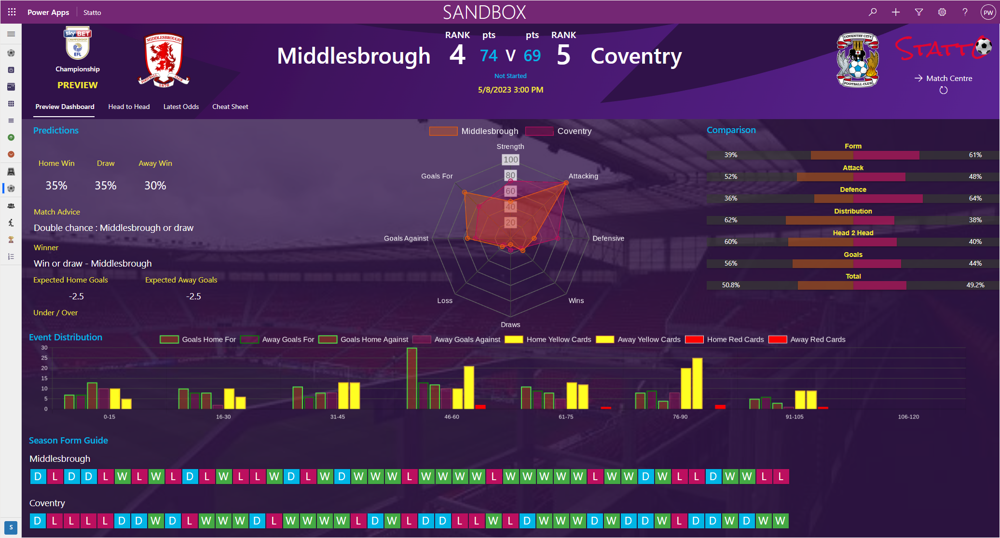
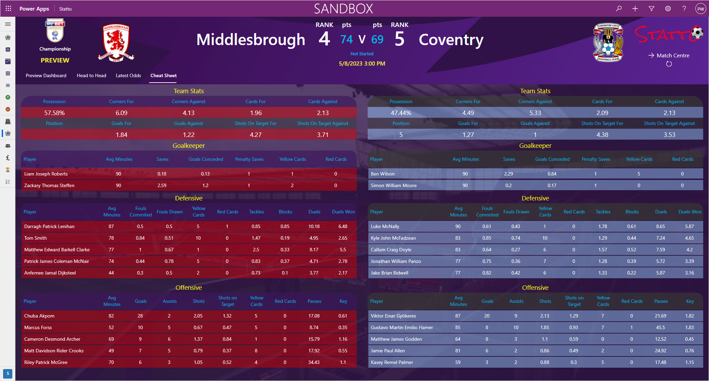
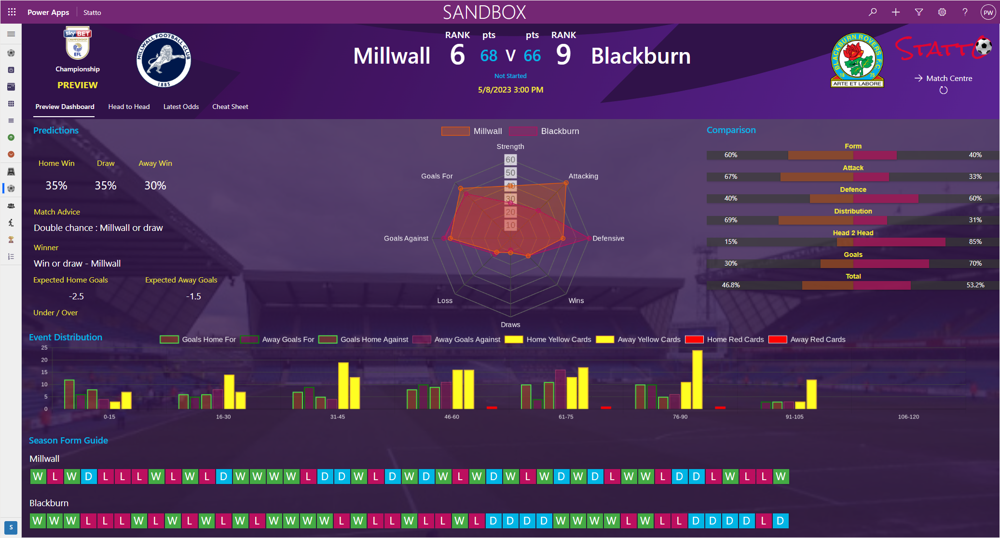
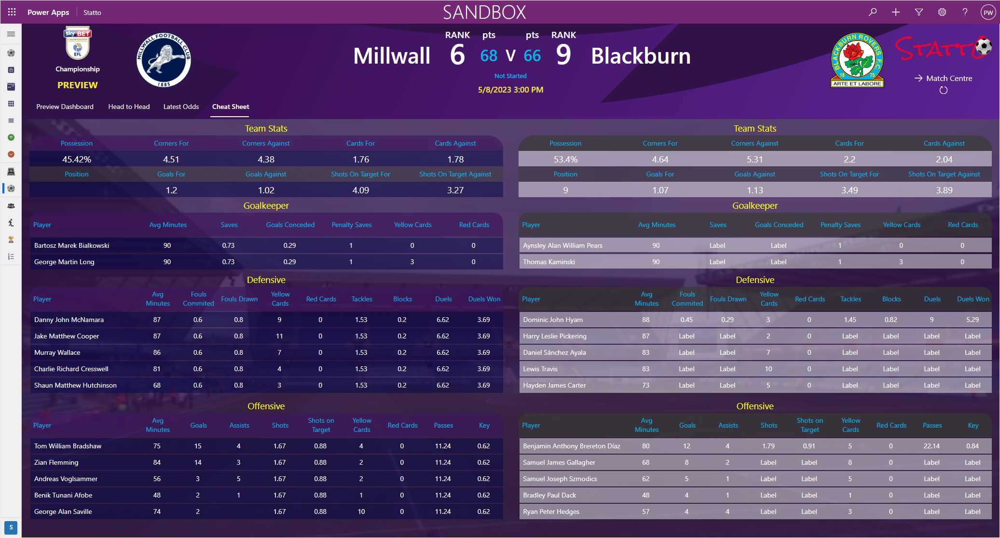
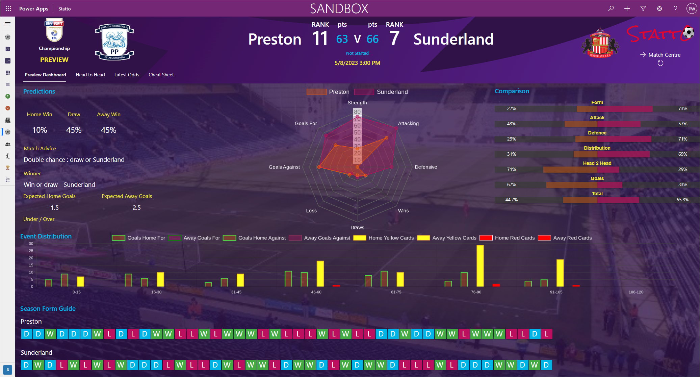
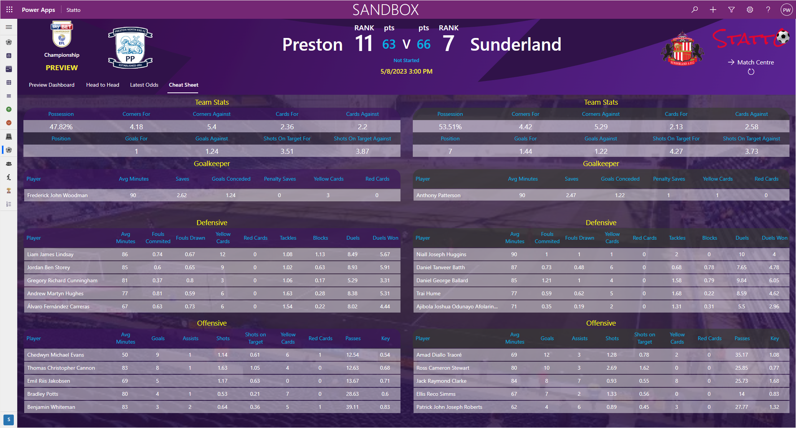

The tension is palpable as Matchweek 46 in the EFL Championship is underway, with just two playoff places still up for grabs. Burnley and Sheffield United have already secured automatic promotion, and Luton and Middlebrough have sealed their places in the playoffs. But with just one game left in the season, four teams are battling it out for the final two spots.

Millwall is not leaving anything to chance and must beat Blackburn to secure their place in the playoffs. The Lions will be roaring with excitement and will be leaving no stone unturned to secure their spot in the postseason.

Sunderland finds themselves in a precarious position and must beat Preston and hope that Coventry, Millwall, and West Brom all lose to have a chance of securing their spot in the playoffs. The Black Cats are clawing their way back into the fight and won't give up until the final whistle.

West Brom is also in the hunt for the final playoff spot and must win their match and hope that the other results go their way. It's all or nothing for the Baggies, and they'll be playing their hearts out to secure their place in the playoffs.

It's a nail-biting finish to the season, and with all games starting at 3 pm, the excitement is sure to be at an all-time high. Every tackle, every pass, and every goal will have a massive impact on the outcome of the season. Who will come out on top and secure their place in the playoffs? 

Only time will tell!

## #MIDCOV Middlesbrough v Coventry

Coventry is on the brink of securing their playoff position and only needs a draw against Middlesbrough to guarantee their spot. However, the stakes couldn't be higher, and if Millwall and Sunderland both win their respective matches and Coventry loses, it will be the Sky Blues who will be missing out on the playoffs.

Coventry are on a six game unbeaten run, whilst Middlebrough have lost their last two. Our API Predictions give a Win or Draw to Middlebrough, tricky one to call.

### #MIDCOV Cheat Sheet

## #MILBLA Millwall v Blackburn

Both need to win, the API predicts Win or Draw for Millwall which would secure a play-off place, Blackburn are one of three on 66 points but have the worst goal difference at -3.

### #MILBLA Cheat Sheet

## #PRESUN Preston v Sunderland

Sunderland another team on 66 points need to win for any chance of the play-offs. Preston on 63 and 11th are not able to reach the play offs this season.

### #MILBLA Cheat Sheet

