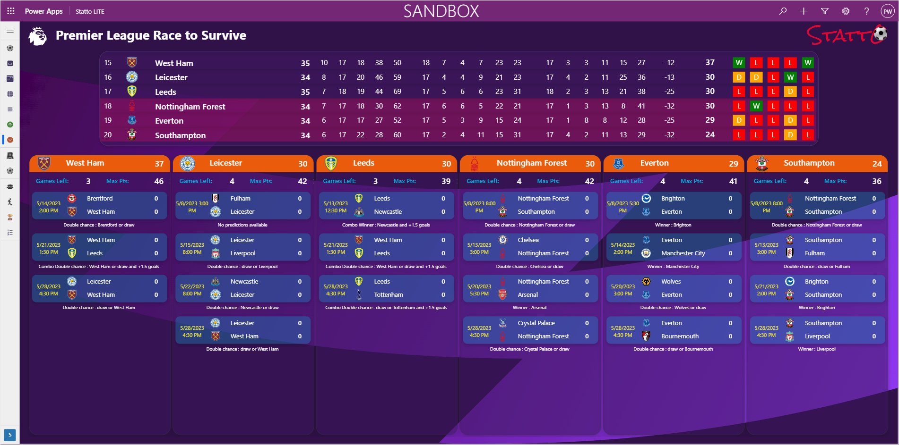
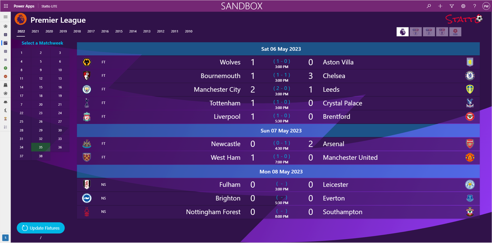
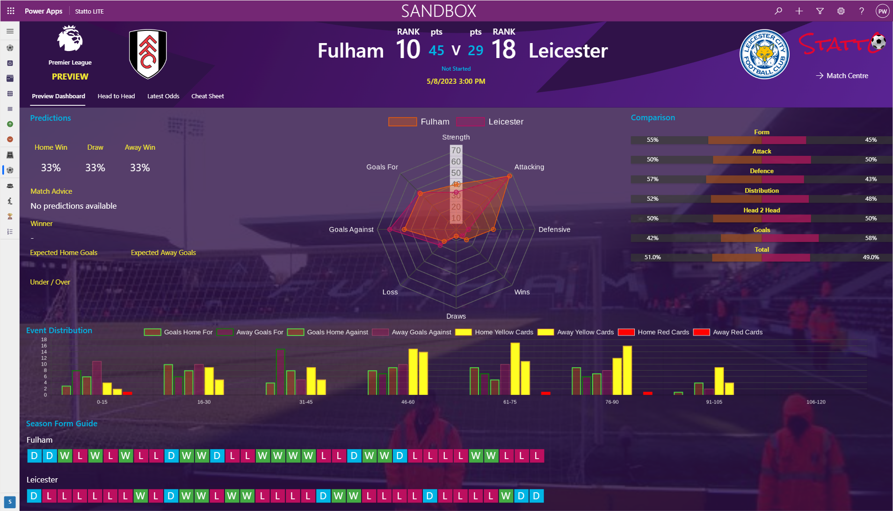
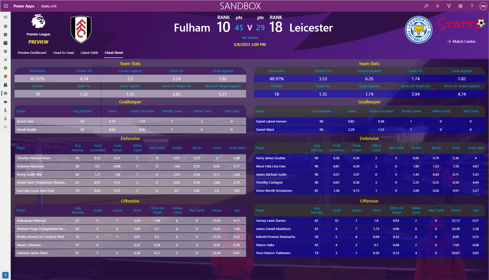
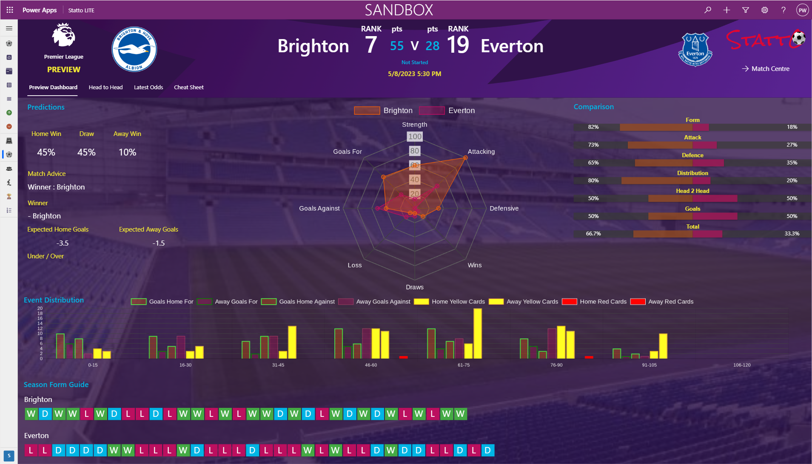
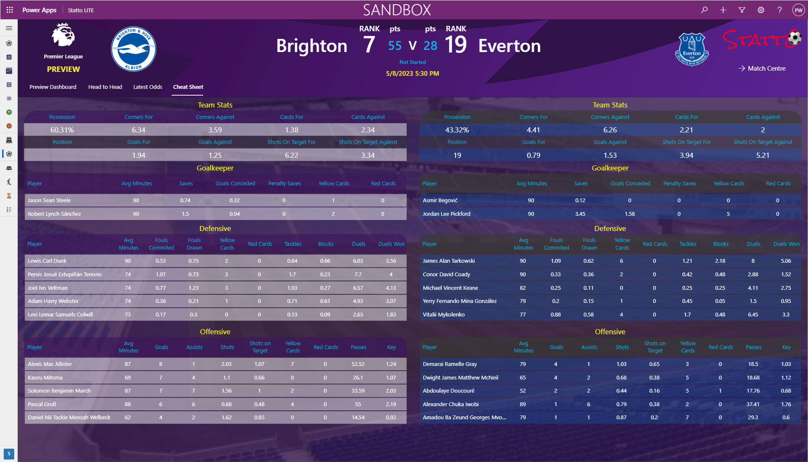
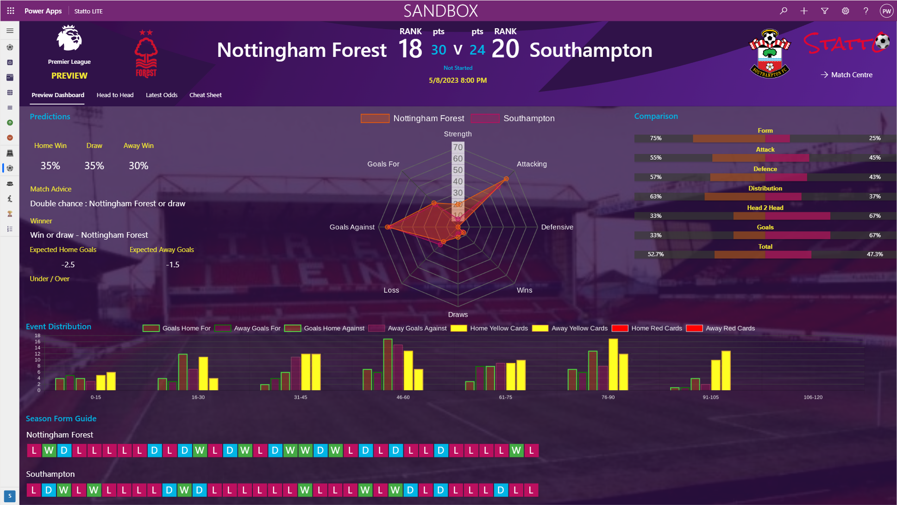
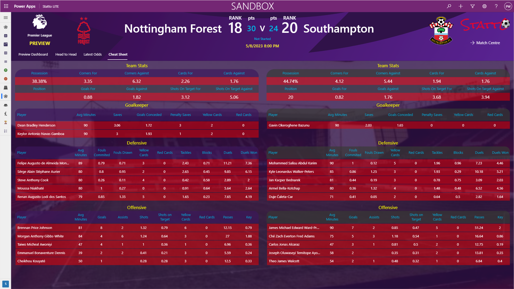

The race to avoid relegation is heating up in the Premier League, with no team mathematically relegated yet and every point counting towards survival.

Today's games feature four of the bottom six teams:

## Fulham v Leicester

Leicester City need to pick up points today in their tricky run, with matches against Liverpool, Newcastle, and West Ham, who have all been in form lately. Fulham, on the other hand, are on a run of three consecutive defeats. While there are no API predictions available for this match, we believe that Leicester City will come out on top or at least earn a draw.

### #FULLEI Cheat Sheet

## Brighton v Everton

As Liverpool fans, we have mixed feelings about this match. On the one hand, it would be amusing to see Everton get relegated, although we do think they would likely come straight back up. On the other hand, we could use some help from Brighton dropping points. The API predicts a Brighton win, and we agree.

### #BRIEVE Cheat Sheet

## Nottingham Forest v Southampton

This match is a real six-pointer, and if Southampton loses, it's curtains for their survival hopes. With matches against Brighton and Liverpool still to come, a loss here could all but seal their fate. 

API predicts Nottingham Forest or Draw.

### #NOTSOU Cheat Sheet

