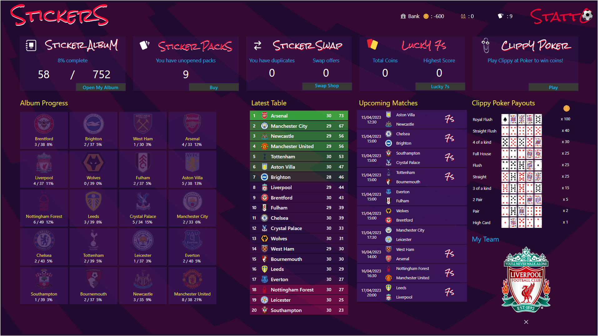

## Welcome to Statto Stickers!

The Power Platform digital Premier League Sticker Album

## Background

As children, collecting stickers for our albums was a beloved pastime that brought us immense joy. Despite our best efforts, however, we were never able to fully complete a single album, no matter how many swaps we made or duplicates we tried to trade away. The thrill of finding rare, coveted shinies kept us endlessly hopeful and engaged.

Now, as we have grown and developed our skills in the digital realm, we have discovered an exciting new way to bring our childhood passions to life. Utilizing the innovative Power Drag Drop component developed by Scott Durow, and building upon the foundation of Statto, we have created a digital version of the beloved sticker album - one that we can actually complete!

Introducing Statto Stickers - a fun and engaging way to enjoy the nostalgia of collecting stickers in a digital format. Our team has poured our hearts and souls into this project, and we are thrilled to share it with you. We hope that you will find as much joy and excitement in playing with Statto Stickers as we did in creating it. So come on in, join us on this adventure, and let's complete some albums together!

:::warning 2022/2023 is a PREVIEW
The 2022/2023 version is a preview to test the features and get feedback, the 2023/2024 version will be released as soon as the Fantasy Premier League details are released at the end of July 2023.

The following features are not yet complete and are still in development:
- sticker store
- lucky 7s
- Completed Team printout
- Completed Album NFT (to be released before the end of the 2023/2024 season)
:::

## Stickers

The objective of the game is to collect stickers, which come in packs of up to 10 random stickers each. These packs can be purchased using 🪙 1000 coins or 👯 75 duplicate stickers. For those hard-to-find stickers necessary to complete the album, the Sticker Store offers a solution. Upon logging in to Stickers for the first time, 🪙 10000 coins will be credited to your account to get you started.

As collecting coins is essential for purchasing sticker packs, we have implemented several fun ways to win them. The weekly game, Lucky 7s, encourages collaboration among players as they compete to top the leader board. For more information on how to play, check out [How to play Lucky 7s](./how-to/2023-04-18-how-to-play-lucky-7s). Each week, on Tuesday's the weekly flow will create the Lucky 7s game and will send  a random number of sticker packs to all players, ranging from 1 to 6 packs.

Another way to earn coins is through playing Clippy Poker, a video poker game that was originally an unfinished experiment to calculate poker hands and create a round-based game. To win big, players can bet 100 coins each hand. For more details on how to play Clippy Poker, visit the [How to play Clippy Poker](./how-to/2023-04-18-how-to-play-clippy-poker) page.

:::tip
It's worth noting that Clippy will allow players to overdraw from their bank account!
:::

To play Statto Stickers, the following components are required:

Power Platform Environment with Custom PCF Components enabled
Premium Power Apps licenses
All app users must have a premium license to use Dataverse and Custom Connectors
A free Football API Key from API-Sports.io
Let's get started! Click "Next" for installation instructions.