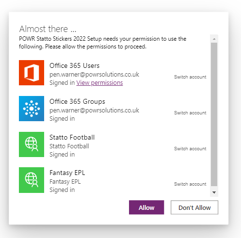
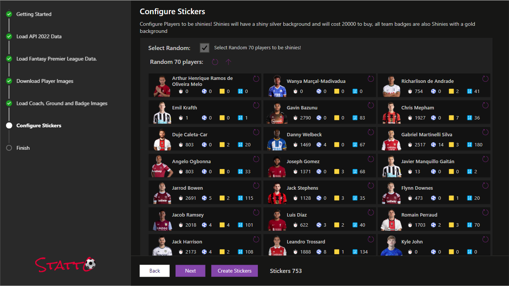

Once the solutions have been imported, Open the **POWR Statto Stickers 2022 Setup** app:

When the app first runs your will be presented with the Connections screen:

for the Statto Football custom connector enter your API key from API-Sports.io.

Add any connections that are missing and click Allow.

### Step 1 - Getting Started

Once the app loads you will be shown the Getting started page, click next to get started.

### Step 2 - Load Data

On the Load API Data 2022 page, click each of the buttons from top (Venues) to bottom (Save Lineups) untill all the progress bars are complete.

### Step 3 - Load FPL Data

Next load the data from the Fantasy Premier League API

### Step 4 - Download Player Images

Click the Save Images button, this will run the **Download Player Images** Cloud Flow, this will take approximately 5 mins to run and there are 692 images available from the API for the 2022/2023 season. Click on the **Refresh** icon to update the progress.

While this is running you can go on to the next screen and come back to check progress.

### Step 5 - Download Team Assets
Click on Save Images to import the stadiums, crests and manager images.

### Step 6 - Configure Player Shiny Stickers

Once all the player images (693) have downloaded, we can configure which 70 players will be Shiny! You can manually select your favourite players, or check the box to randomly select 70 players. On the Random select page, you can also use the up arrow to select the top 70 players by number of Fantasy Premier League points.

Select 70 random players.

Select the top 70 players using the refresh icon.

Once you have decided on your shinies configuration, click on **Create Stickers** this will save your configuration.

### Step 7 - Configure User Security Roles
Users of Statto stickers require 2 security role:

- App Opener
- Stickers User

### Step 8 - Share the app

Last step is to share the canvas app with your users.