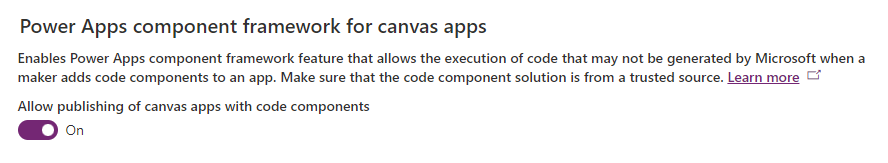

## Installation
:::info
This documentation asssumes the reader has good understanding of the Power Platform and its concepts such as Environments, Solutions, Canvas Apps, Dataverse.
:::

### Pre requisites

- A Power Platform environment with Dataverse with Code Components enabled.
- The PowerCAT Creator Kit
- Scott Durow's Drag and Drop pcf
- A Free API key from API-Sports.io

Sign up for a Free API Key [API-Sports.io](https://api-sports.io)

Make a note of your API key, you will need it the first time your run the Setup Canvas App

You will need either a Power Platform Developer environment or a fully licenced environment.  The solution uses, Dataverse and custom connectors both features require premium licences.

#### Configure environment for PCF components.

Statto Stickers is made with components from the Power CAT Creator Kit and Scott Durow's Power Drag Drop component.

Open Admin.powerplatform.microsoft.com, select the environment and navigate to Settings and check the Power Apps component framework for canvas apps and save the page.

#### Import the Power CAT Creator Kit

Download the latest version of the [PowerCAT Creator Kit](https://github.com/microsoft/powercat-creator-kit) and import into your environment.

#### Import the Power Drag Drop Component

Download the latest version from [Github](https://github.com/scottdurow/power-drag-drop) and import into your environment.

#### Import the Stickers Solution

Download the latest version from [Github](https://github.com/) and import into your environment.

